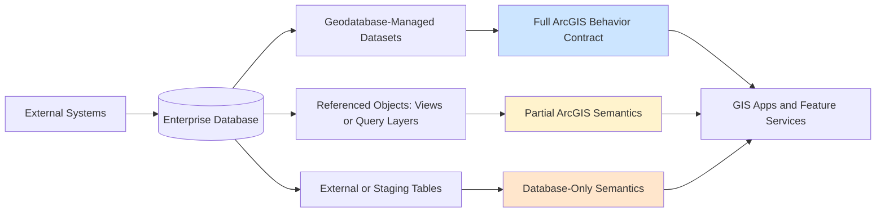
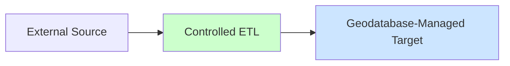
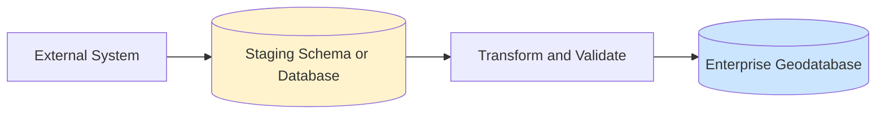
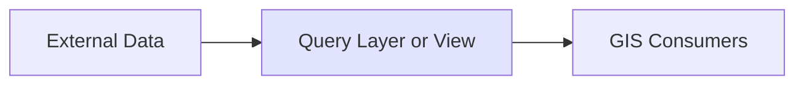

## Introduction

A table can exist in the same enterprise database as your ArcGIS geodatabase and still not behave like geodatabase data.

That distinction causes many production issues that are hard to diagnose. GIS teams may see inconsistent editing behavior or publishing limitations. DBAs and integration teams may see ArcGIS requirements as opaque or unnecessary. Both are often observing the same root problem: **a system contract mismatch**.

The key question is not "Can ArcGIS see this table?" The key question is "Which ArcGIS behaviors must this dataset support?"

## Problem / Context

An enterprise geodatabase is not just storage in SQL Server, Oracle, or PostgreSQL. It is an ArcGIS-managed behavior layer over the database.

That behavior layer enables workflows such as:

- Versioning (traditional and branch)
- Archiving and historical state management
- Editor tracking
- Domains and subtypes
- Relationship classes
- Topology and network rules
- Feature service editing capabilities

Those capabilities depend on ArcGIS-managed metadata, rules, and supported access paths. Database co-location alone does not provide that.

## Key Concepts

### Three Data Categories in One Database

In many enterprise environments, all of these can coexist in the same RDBMS:

1. **Geodatabase-managed datasets**
2. **Database objects ArcGIS can reference with limited semantics** (for example, query layers and views)
3. **External or staging tables** owned by non-GIS systems

Confusion starts when category 2 or 3 is treated as category 1.

### Contract Comparison

| Aspect                | Geodatabase-Managed Dataset                                  | Referenced or External Table                                    |
| --------------------- | ------------------------------------------------------------ | --------------------------------------------------------------- |
| ArcGIS behavior model | Full geodatabase participation                               | Partial or none, depends on access method                       |
| Metadata dependency   | ArcGIS-managed metadata and rules                            | Primarily database-native metadata                              |
| Editing workflows     | Supports ArcGIS-managed editing patterns                     | Often limited or read-only in GIS workflows                     |
| Validation model      | Domains, subtypes, ArcGIS-aware rules                        | DB constraints may exist, but not equivalent to ArcGIS behavior |
| Service capabilities  | Broad support when dataset and platform requirements are met | Capability varies; often reduced or constrained                 |

The point is not that referenced or external tables are invalid, rather that they should not be assumed to provide geodatabase-managed behavior.

## Architecture Overview

**Key insight:** ArcGIS visibility is not the same thing as ArcGIS behavioral support.

## Example / Walkthrough

Consider a common integration pattern:

- An external asset management system writes directly to database tables.
- GIS users join those tables to feature classes and publish workflows through ArcGIS Enterprise.
- Teams assume that because the data is in the same database, ArcGIS workflows will behave consistently.

### Where the Mismatch Appears

1. **Validation assumptions fail**
   - External writes may satisfy database constraints but still miss ArcGIS domain/subtype expectations used by maps, editing tools, or downstream QA checks.

2. **Editing expectations drift**
   - Workflows designed around ArcGIS-managed editing may not apply to externally managed objects.

3. **Audit and tracking assumptions fail**
   - Teams may expect editor tracking-like outcomes where that behavior is not actually configured or supported in the GIS workflow.

4. **Publishing and capability gaps appear**
   - Service behavior can differ depending on dataset type, ownership model, and supported ArcGIS data path.

This is why incidents often appear as "ArcGIS inconsistency" when the real problem is an undefined contract boundary.

## Direct SQL: What Is Actually Risky

Direct SQL is not universally wrong. The risk depends on the dataset and workflow.

Higher-risk cases include datasets and processes that rely on ArcGIS-managed behavior, such as:

- Versioned editing models
- ArcGIS-managed historical workflows
- Service-based editing patterns
- Datasets tied to ArcGIS relationship or rule frameworks

Lower-risk cases are usually controlled and explicit, such as:

- Read-only lookup tables
- Staging/intermediate integration tables
- Reporting tables not treated as authoritative GIS operational datasets

The operational rule is simple: if the workflow depends on ArcGIS behavior, use supported ArcGIS data management paths and clearly governed write patterns.

## Recommended Patterns

### Pattern 1: Controlled ETL into Geodatabase-Managed Datasets

- Apply schema mapping and quality checks before load.
- Enforce ArcGIS-required structure in the managed target.
- Recommended to utilise Arcpy or FME to load the data.

### Pattern 2: Isolated Staging Boundary

- Keep raw integration writes out of operational GIS datasets.
- Use SSIS or similar tools to load into the staging database.
- Promote data into GIS operational layers through explicit governance.
- Recommended to utilise Arcpy or FME to load from the staging database into the geodatabase.

### Pattern 3: Read-Only Federation Where Appropriate

- Use for discovery, context, and reporting.
- Document capability limits so teams do not design unsupported edit workflows.

## Practical Decision Checklist

Before using a table in GIS operations, ask:

- Does this dataset need geodatabase-managed behavior?
- Who owns writes and schema changes?
- Will this be edited through services or versioned workflows?
- Are ArcGIS validation semantics required?
- Is read-only access sufficient?

If these answers are unclear, the boundary is unclear.

## Conclusion

The risk is not mixing data in one enterprise database. The risk is mixing assumptions.

A table can be visible to ArcGIS without participating in the full geodatabase behavior model. Treat that boundary as an architectural contract, not an implementation detail.

When teams define ownership, write paths, and supported behavior explicitly, both GIS and IT workflows become more predictable, supportable, and safe.
