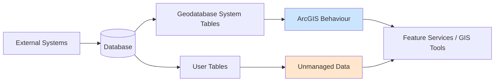
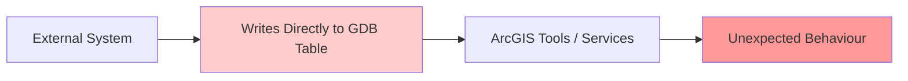
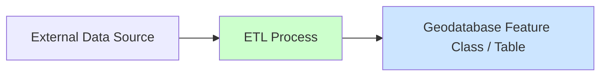
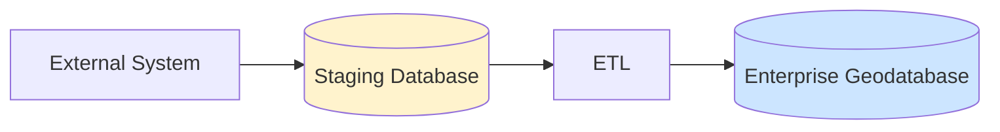
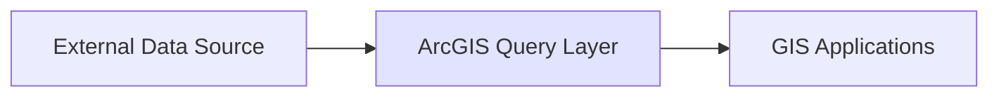

## Introduction

Just because a table exists in your enterprise geodatabase does not mean ArcGIS understands it.

This is a subtle but important distinction that often leads to confusing behaviour, failed processes, and data integrity issues. For GIS administrators, the problem typically appears as “ArcGIS acting strangely.” For DBAs and data engineers, it can look like unnecessary constraints or opaque system behaviour.

In reality, the issue might be neither — rather a mismatch between **managed geodatabase datasets** and **unmanaged database tables**.

---

## Enterprise Geodatabases Are More Than Just Databases

An enterprise geodatabase is not simply a collection of tables stored in a relational database. It is a **managed system layered on top of an RDBMS** that introduces behaviour, rules, and metadata.

These include:

- Versioning (traditional and branch)
- Archiving
- Editor tracking
- Domains and subtypes
- Relationship classes
- Topology and network rules
- Feature service compatibility

All of this behaviour is driven by metadata stored in geodatabase system tables and enforced through ArcGIS tools and services.

---

## The Core Problem: Contract Mismatch

At a technical level, the issue is not where the data lives—it is how it is understood.

| Aspect        | Geodatabase Dataset         | Plain Database Table   |
| ------------- | --------------------------- | ---------------------- |
| Behaviour     | Managed by ArcGIS           | Unknown to ArcGIS      |
| Metadata      | Stored in GDB system tables | None                   |
| Editing Model | Versioned / tracked         | Direct SQL             |
| Validation    | Domains, subtypes           | None                   |
| Services      | Fully supported             | Limited / inconsistent |

A plain table does not participate in the geodatabase system unless it has been explicitly created or registered through ArcGIS.

---

## Architecture Overview

**Key insight:** Both managed and unmanaged data can exist in the same database, but only one is governed by ArcGIS.

---

## Real-World Failure Scenarios

### 1. Versioning Mismatch

A feature class is versioned, but a related plain table is not. Joins and edits behave inconsistently across versions, leading to confusion and potential data loss.

### 2. Missing Editor Tracking

A workflow assumes editor tracking is enabled, but the plain table does not support it. Audit requirements fail silently.

### 3. Domains Not Enforced

Invalid values are inserted into a plain table. Downstream tools, symbology, or validation processes break or behave unpredictably.

### 4. Geoprocessing Inconsistencies

Some geoprocessing tools expect geodatabase-managed datasets. Plain tables may partially work, fail, or produce unexpected results.

### 5. Feature Service Issues

Publishing services that rely on unmanaged tables can lead to missing capabilities, errors, or unsupported operations.

---

## Data Flow Anti-Pattern

Direct writes bypass geodatabase rules and create hidden risks.

## Recommended Patterns

### Pattern 1: Controlled ETL into Geodatabase

- Use ArcGIS tools or ETL platforms
- Enforce schema, domains, and structure during load

### Pattern 2: Staging Database

- Isolate raw data
- Apply transformations before ingestion

### Pattern 3: Read-Only Federation

- Avoid duplicating data unnecessarily
- Clearly communicate limitations

## When Plain Tables Are Acceptable

There are valid use cases for plain tables within the same database:

- Read-only lookup tables
- Staging or intermediate processing tables
- Integration points with external systems

However, these must be:

- Clearly documented
- Treated as **non-geodatabase data**
- Not assumed to support ArcGIS behaviours

## Practical Rules for GIS and IT Teams

- Do not assume all tables in a geodatabase are geodatabase-managed
- Only use datasets created or registered via ArcGIS tools for GIS workflows
- Avoid direct SQL writes to managed datasets unless fully understood
- Separate raw data ingestion from curated geospatial data
- Document ownership and data flow boundaries

## Conclusion

Enterprise geodatabases work because they enforce structure, rules, and behaviour.

When unmanaged tables are introduced without clear boundaries, that structure breaks down — not always immediately, but often in subtle and difficult-to-diagnose ways.

The goal is not to eliminate flexibility, but to ensure that flexibility is applied **deliberately and safely**.

In practice, this means treating the geodatabase not just as a storage location, but as a **system with expectations** — and ensuring all data within it either meets those expectations or is clearly isolated from them.
